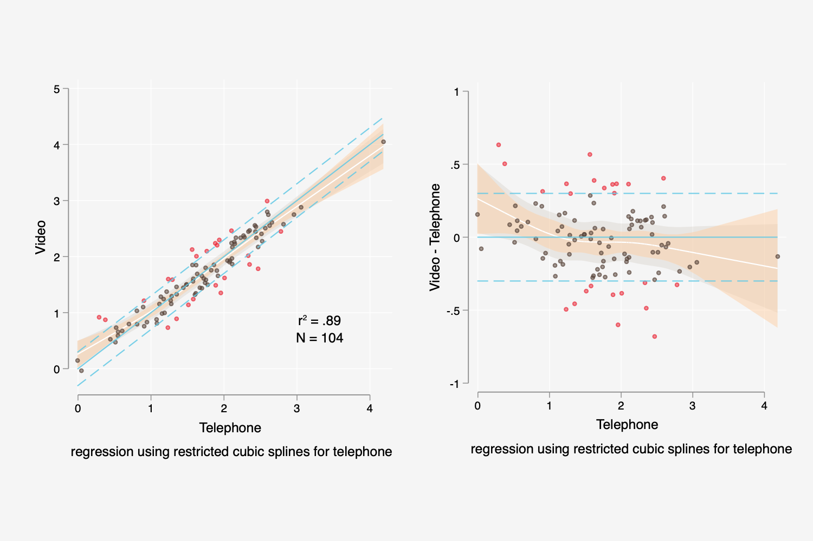

# Stata
Some of my Stata ados not distributed elsewhere. Send questions via [email](mailto:rnjones@brown.edu).

## mcrnj.ado, mcrnj.sthlp
Prepares a method comparison two-panel plot. Here is an example



The left panel is a scatterplot `mcrnj` prepares a two-panel plot. The left panel is a scatterplot of *yvar* by *xvar*. Reference lines at *yvar=xvar* and *yvar = xvar ± caliper* are shown. The points in the scatterplot are colored according to whether they are within or outside of the caliper. A predicted line using restricted cubic spline regression of `yvar` on `xvar` (`modeltype(rcs)` is the default option) or Deming regression (`modeltype(deming)`) is shown. Two sets of $1-t({\alpha/2},N-2})$ confidence regions are plotted based on this regression. The narrower (gold color) uses the standard error of estimate, and is appropriate for comparing within the sample (i.e., can I treat these two measures as eqiuvalent in this sample?). The other is somewhat wider (taupe
color) and uses the standard error of prediction, and is appropriate for making inferences regarding whether the two measures are equivalent for future samples. 

The right panel is the scatterplot with *yvar* and derived variables centered at *xvar*. 

Note: the use of the `modeltype(deming)` option requires that the `deming` module is installed. If you don't have it installed try typing  `findit deming`.

### Example

```
mcrnj gcp5 gcp6 , modeltype(rcs) ytitle(Video) xtitle(Telephone) note(regression using restricted cubic splines for telephone)

mcrnj gcp5 gcp6 , modeltype(deming) ytitle(Video) xtitle(Telephone) note(regression using Deming regression for telephone)
```
### Notes

Using `alpha(.1)` will provide 90% confidence intervals. These can be used to approximate two 1-sided t-tests at the 5% significance level that the $E(yvar|f(xvar))$ is greater than (or less than) the `caliper`. This is an equivalence test of the two measures. (Of course, one could also present 95% CIs and approximate two t-tests at the 2.5% significance level.)

Deming regression is an approach used often in clinical chemsitry to compare two measures. It allows for measurement error in `xvar`. 


